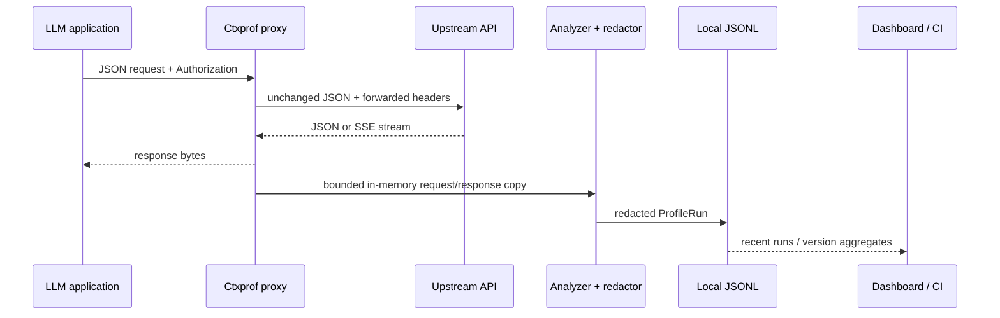
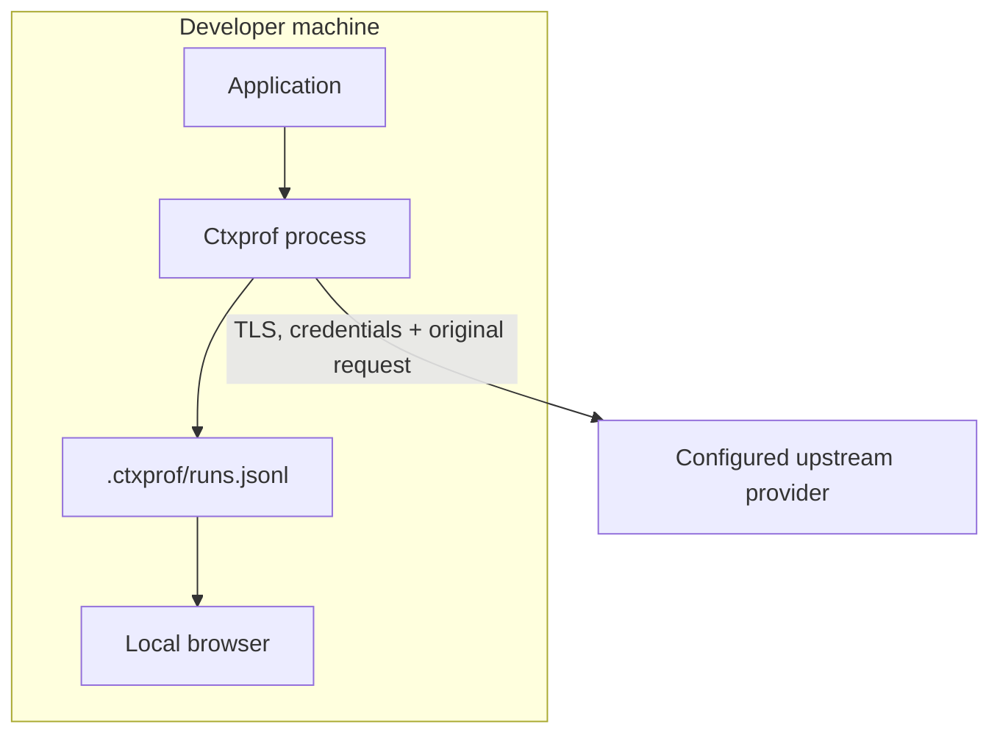

# Ctxprof architecture

Ctxprof is a single-process local diagnostic tool. It has two ingestion paths—an OpenAI-compatible proxy and offline files—and one normalized output, `ProfileRun` schema version 1.

## Data flow

Forwarding is the latency-sensitive path. The client receives upstream bytes before persistence completes. A persistence failure does not alter an already returned model response; it is reported to process diagnostics and the write queue remains usable for a later capture.

## Modules

| Module | Responsibility |
|---|---|
| `src/server.ts` | Local HTTP UI/API, remote-bind guard, upstream forwarding, stream collection |
| `src/analyzer.ts` | Chat/Responses extraction, component attribution, usage allocation, warnings |
| `src/redaction.ts` | Recursive sensitive-key and inline-pattern redaction, truncation, safe errors |
| `src/tokenizer.ts` | Stable dependency-free directional estimator and canonical JSON serialization |
| `src/pricing.ts` | Dated standard-text catalog, exact model matching, user catalog validation |
| `src/importer.ts` | JSON, JSONL, HAR, OpenAI Batch, and normalized-run ingestion |
| `src/store.ts` | Append-only JSONL persistence and partial-tail recovery |
| `src/compare.ts` | Prompt-version aggregation and A→B deltas |
| `src/budget.ts` | Absolute limits, committed baseline regression checks, violations |
| `src/ui/dashboard.ts` | Self-contained accessible treemap, component details, warnings, A/B view |
| `src/cli.ts` | Command routing, text/JSON output, lifecycle, GitHub annotations |

## Trust boundaries

The proxy and application share the same trust level. The upstream provider is explicitly chosen by the operator. The browser is local but unauthenticated; exact Host allowlisting and same-origin Origin checks prevent unrelated DNS/browser origins from treating the dashboard as their own service. Remote reverse-proxy domains are explicit `allowedHosts`, never trusted from forwarding headers. Disk is not assumed to be encrypted. See [SECURITY.md](SECURITY.md) for deployment guidance.

## ProfileRun v1

A run contains:

- identity, timestamp, source, endpoint, status, duration, model, label, and prompt version;
- a non-exact tokenizer declaration;
- the exact matched pricing record or `null`;
- ordered input components with estimated and provider-allocated token counts;
- totals, including separate provider input usage when available;
- structured, explainable warnings;
- a redacted/capped exchange or explicit metadata-only marker.

Component allocation preserves the provider input total: each estimated component receives a proportional count, with rounding remainder assigned to the largest component. This makes the treemap reconcile with billing usage while keeping its decomposition explicitly approximate.

## Persistence

The store is newline-delimited JSON rather than SQLite because the expected local workload is append-heavy, single-process, and easy to inspect or delete. Every append is serialized through an in-process promise queue. Readers skip an invalid trailing line so a terminated write does not hide earlier captures.

JSONL is not intended for multiple writers, large shared teams, retention policies, or distributed tracing. A future store interface can add SQLite without changing `ProfileRun`.

## Token and cost semantics

The default estimator counts CJK/emoji code points individually and remaining UTF-8 bytes at roughly four bytes per token, plus small protocol overheads. It is stable across machines, which matters for CI, but it is not a provider tokenizer.

Provider usage replaces the displayed input total when present. Component costs use the proportionally allocated provider count. Standard text prices match exact catalog IDs and dated snapshot suffixes only. Unknown models remain unpriced.

Complex billing metadata—cached reads/writes, batch, service tier, tool fees, media modalities, regional processing, and long-context thresholds—is not inferred from incomplete responses.

## HTTP surface

| Route | Mode | Purpose |
|---|---|---|
| `GET /` | serve/proxy | Local dashboard |
| `GET /healthz` | serve/proxy | Container/process health |
| `GET /api/runs?limit=N` | serve/proxy | Recent normalized runs |
| `GET /api/compare?from=A&to=B` | serve/proxy | Aggregate version diff |
| `POST /v1/*` | proxy only | OpenAI-compatible forwarding/profiling |

There are no mutation endpoints for stored captures in v0.1. Filesystem access remains the explicit data-management boundary.

## Invariants

1. Never persist ordinary request or response headers; only the documented `x-ctxprof-label` and `x-ctxprof-version` values become run metadata.
2. Never print credentials or captured content.
3. Reject remote binding unless the operator supplies `--allow-remote`.
4. Never price a fuzzy/nearby model ID.
5. Never label component token estimates as exact.
6. Never mutate a request or response as part of profiling.
7. Keep the offline fixture workflow fully functional without network or credentials.
