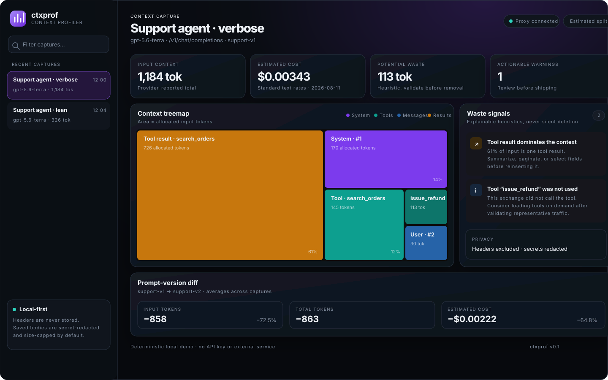
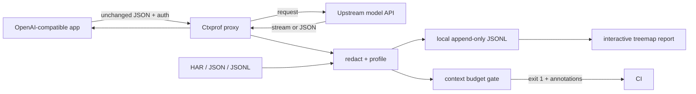

<p align="center">
  
</p>

<h1 align="center">Ctxprof</h1>

<p align="center"><strong>The flamegraph for your LLM context window.</strong></p>

<p align="center">
  See which prompts, tool schemas, messages, and tool results consume tokens.<br>
  Compare prompt versions. Fail CI before context bloat ships.
</p>

<p align="center">
  
  
  
  
</p>

<p align="center">
  
</p>

Ctxprof exists because a request that says “12k tokens” does not tell you what to fix.

- **See the composition, not just the total.** Interactive treemaps attribute input to system/developer prompts, individual tool definitions, messages, tool results, and response schemas.
- **Measure prompt changes like code changes.** Stable version labels produce A→B token, cost, warning, and component diffs across representative captures.
- **Put a budget in CI.** Commit a baseline and fail a pull request when total tokens, estimated cost, or any component grows past its allowance.

Everything runs locally. The proxy has zero runtime dependencies, listens on loopback by default, never stores ordinary request/response headers, redacts common secrets, and offers a preview-free `--capture none` mode. The explicit `x-ctxprof-label` and `x-ctxprof-version` values become bounded run metadata.

## Quick start

Ctxprof `0.1.0` is available from [npm](https://www.npmjs.com/package/ctxprof) and [GitHub Releases](https://github.com/Dtdkvn/ctxprof/releases/tag/v0.1.0). With Node.js 22 or 24:

```bash
npm install --global ctxprof
ctxprof demo
ctxprof serve
```

Open [http://127.0.0.1:8787](http://127.0.0.1:8787). The deterministic demo needs no API key and includes a deliberately bloated `support-v1` plus a lean `support-v2`.

To run the reviewed source directly instead:

```bash
git clone https://github.com/Dtdkvn/ctxprof.git
cd ctxprof
npm ci
npm run build
node dist/cli.js demo
node dist/cli.js serve
```

Want Docker instead? One command builds the image, starts the proxy, and persists captures in a named volume:

```bash
docker compose up --build
```

The Compose port is published to `127.0.0.1` only.

### Runtime and module format

Ctxprof supports maintained Node.js 22 and 24 releases. Its CLI works after a global or local install; the programmatic API is ESM-only:

```js
import { analyzeExchange, estimateTokens } from "ctxprof";
```

Static CommonJS `require("ctxprof")` is intentionally unsupported. From a CommonJS application, use `await import("ctxprof")` or migrate the caller to ESM.

## Put it in front of an OpenAI-compatible app

Start the proxy:

```bash
export OPENAI_API_KEY="..."
ctxprof proxy --upstream https://api.openai.com
```

Then change only the SDK base URL. Ctxprof forwards Chat Completions and Responses API JSON POSTs, including streaming responses.

```ts
import OpenAI from "openai";

const client = new OpenAI({
  baseURL: "http://127.0.0.1:8787/v1",
  defaultHeaders: {
    "x-ctxprof-version": "support-v3",
    "x-ctxprof-label": "checkout support",
  },
});
```

The optional headers are consumed locally, persisted as the bounded `label` and `promptVersion` fields, and not forwarded upstream. Do not put secrets in them. An incoming `Authorization` header takes precedence over `OPENAI_API_KEY`; neither credential is persisted.

Open the live dashboard at the same origin; while visible, it conditionally polls a lightweight summary feed and lazily loads only the selected bounded profile. New captures appear without a reload, and unchanged polls carry no JSON body. Or export a portable report:

```bash
ctxprof report --output context-report.html
ctxprof compare support-v2 support-v3
```

### Any compatible provider

Point `--upstream` at a local or hosted server exposing OpenAI-compatible `/v1/chat/completions` or `/v1/responses` routes:

```bash
ctxprof proxy --upstream http://127.0.0.1:1234/v1
```

The upstream deadline defaults to two minutes and can be changed with `--upstream-timeout-ms` or `CTXPROF_UPSTREAM_TIMEOUT_MS`. Redirects are never followed.

Request headers cross a strict positive allowlist: `Authorization`, JSON content metadata, `Accept`, `User-Agent`, `Idempotency-Key`, OpenAI headers, Stainless SDK metadata, and exact Anthropic/Azure/Google auth, version, beta, and project headers. Everything else is dropped by default, including arbitrary identity-proxy headers. A custom provider header requires an explicit repeatable `--forward-header <name>` opt-in; only add one after reviewing the provider contract because its value leaves the machine.

For deliberate team access behind an authenticated reverse proxy, allow both the remote bind and its exact public hostname:

```bash
ctxprof serve --host 0.0.0.0 --allow-remote --allowed-host ctxprof.example
```

`--allowed-host` accepts a hostname only—no scheme, port, path, or wildcard—and can be repeated. Without it, a wildcard bind accepts only literal local/socket IP Host values and localhost; this keeps arbitrary DNS names from reading the unauthenticated dashboard.

Unknown models still receive component and token analysis. Cost stays visibly **unknown** until there is an exact catalog match—Ctxprof never guesses a similar model's price.

## Import first, connect a key later

Most of Ctxprof is useful without live traffic. It accepts:

- a raw OpenAI Chat Completions or Responses request;
- `{ "request": ..., "response": ... }` JSON;
- JSON arrays, JSONL/NDJSON, and OpenAI Batch-style records;
- HAR files containing JSON API exchanges;
- Ctxprof's own `ProfileRun` records.

```bash
ctxprof analyze capture.har
ctxprof import evals/*.json --prompt-version candidate-7
ctxprof report
```

Use `--json` for machine-readable analysis and `--report report.html` to create a report without adding anything to the store.
Every explicitly named input must contain at least one supported record. Empty JSONL/arrays, empty or unsupported HAR exports, and a single empty file mixed into a larger evaluation fail the command instead of silently shrinking coverage.

## Context budget tests

`ctxprof check` is a bundle-size check for prompts. This repository dogfoods it with deterministic fixtures.

```json
{
  "$schema": "./node_modules/ctxprof/docs/ctxprof-config.schema.json",
  "input": ["evals/support.json", "evals/extractor.json"],
  "baseline": ".ctxprof-baseline.json",
  "limits": {
    "inputTokens": 8000,
    "estimatedCostUsd": 0.05,
    "components": { "tools": 2500, "system": 1200 }
  },
  "regressions": {
    "inputTokensPercent": 5,
    "estimatedCostPercent": 8,
    "componentPercent": 10,
    "warningsIncrease": 0
  }
}
```

Create the baseline, commit it, then gate every pull request:

```bash
ctxprof check --update-baseline
ctxprof check
```

The check exits `1` and explains every violated metric. Explicit config paths and inputs must exist and produce cases, and regression thresholds require a loaded baseline. A cost limit also fails when pricing is unknown; silently treating unknown cost as zero would make the gate unsafe.

### GitHub Action

The reviewed `v0.1.0` Action is live. Pin the version tag for convenience or the tag's full commit SHA for an immutable supply-chain reference:

```yaml
- uses: Dtdkvn/ctxprof@v0.1.0
  with:
    config: ctxprof.config.json
```

The Action ships reviewed JavaScript, uses GitHub's Node 24 Action runtime, and performs no install or build in the caller workflow. Repository CI exercises it through `uses: ./`. Action file paths are confined to the canonical repository workspace; use relative `config` and `pricing` inputs. It emits native workflow annotations; see the complete [workflow example](examples/github-actions/context-budget.yml) and [CI guide](docs/CI.md).

## What the profiler counts

| Component | Chat Completions | Responses API |
|---|---|---|
| System policy | `messages[role=system]` | `instructions` and system input |
| Developer policy | `messages[role=developer]` | developer input messages |
| Tool definitions | each `tools[]` entry | each `tools[]` entry |
| Messages | user/assistant content | input messages/items |
| Tool results | `messages[role=tool]` | `function_call_output` / `tool_result` |
| Other prompt material | `response_format` | structured `text.format` |

When the provider returns input usage, Ctxprof shows that exact total and allocates it proportionally across estimated components. Without usage, both totals and components use the deterministic `utf8-byte-estimate-v1` heuristic. This is intentionally labeled as an estimate; model tokenizers and multimodal accounting differ.

### Explainable waste signals

Warnings never rewrite or delete prompts. They identify candidates to validate:

- tools defined but not called in this exchange;
- tool schemas above 1,000 estimated tokens;
- one tool result consuming at least 2,000 tokens or 25% of input;
- duplicate context blocks;
- a system prompt consuming at least 35% of input;
- estimated context-window pressure.

“Unused tool” is evidence about one capture, not proof that a tool can be removed. Compare representative traffic before changing production behavior.

## Pricing without false precision

The built-in standard text-token catalog is source-linked and date-stamped. Run `ctxprof pricing` to inspect it. It currently covers commonly used OpenAI GPT-5.6, GPT-5.5, GPT-5.4, GPT-5, and GPT-4.1 model IDs using [official model documentation](https://developers.openai.com/api/docs/models), checked on 2026-08-11.

Ctxprof deliberately does not pretend to account for cached input, cache writes, batches, priority processing, regional uplifts, built-in tool fees, audio/images, or long-context multipliers without the required billing metadata. Provide an exact catalog for another provider or negotiated rates:

```bash
ctxprof analyze request.json --pricing ctxprof.pricing.json
```

See [ctxprof.pricing.example.json](ctxprof.pricing.example.json).

## Privacy model

Default capture is safer, not magical:

- the store is append-only JSONL under `.ctxprof/runs.jsonl` with best-effort owner-only POSIX permissions;
- request/response headers are never stored;
- sensitive key names and common API-key formats are replaced with `[REDACTED]`;
- stored exchanges are capped; oversized bodies are omitted and represented by a hash;
- previews are redacted and short;
- there is no “unsafe full capture” switch;
- `--capture none` retains component metrics and hashes but omits request/response bodies and component previews.

Redaction cannot recognize every private or proprietary string. The local dashboard has no authentication and must not be exposed directly to an untrusted network. Read [SECURITY.md](SECURITY.md) and the detailed [privacy guide](docs/PRIVACY.md) before profiling production traffic.

## Where Ctxprof fits

Ctxprof is deliberately narrow. It complements observability and evaluation platforms rather than trying to become one.

| Tool | Primary job | Best fit |
|---|---|---|
| **Ctxprof** | Context composition, version A/B diffs, CI regression budgets | “Which input component grew, what does it cost, and should this PR fail?” |
| [ContextLens](https://pypi.org/project/contextlens-profiler/) | Interactive context flamegraph/treemap and waste analysis | Exploring the contents and rebilling behavior of a captured context |
| [Langfuse](https://langfuse.com/docs/prompt-management/data-model) | LLM observability plus managed prompt versions and labels | Tracing and operating prompts across an application lifecycle |
| [promptfoo](https://www.promptfoo.dev/docs/configuration/expected-outputs/) | Prompt/model evaluation and output assertions | Testing response quality, safety, and behavior across cases/providers |

Feature surfaces change quickly; the links above are the source of truth. Ctxprof's differentiator is a local import/proxy workflow joined directly to a component-aware baseline gate.

## Command reference

| Command | Purpose |
|---|---|
| `ctxprof proxy` | OpenAI-compatible proxy plus live dashboard |
| `ctxprof serve` | Read-only local dashboard over stored runs |
| `ctxprof import <files...>` | Import JSON, JSONL, or HAR into the store |
| `ctxprof analyze <files...>` | Analyze without persisting |
| `ctxprof report` | Self-contained interactive HTML export |
| `ctxprof compare <A> <B>` | Aggregate prompt-version diff |
| `ctxprof check` | CI context budget gate |
| `ctxprof demo` | Deterministic no-key demo |
| `ctxprof pricing` | Inspect dated model rates |
| `ctxprof doctor` | Verify runtime and privacy defaults |

Run `ctxprof help` or `ctxprof help check` for flags.

## Architecture



The proxy forwards first and observes a bounded copy of the response. Analysis and storage never modify the payload sent to the model or returned to the client. See [ARCHITECTURE.md](ARCHITECTURE.md) for module boundaries, trust boundaries, and data formats.

## Development

```bash
npm ci
npm run check
npm run smoke
```

Node 22 and 24 are tested. Runtime code uses only Node built-ins; TypeScript and `tsx` are development dependencies. Docker, GitHub Actions, a JSON Schema, fixtures, and a mock-upstream integration test are included.

Contributions are welcome—especially new import adapters, conservative waste heuristics, and dated pricing updates backed by official provider sources. Start with [CONTRIBUTING.md](CONTRIBUTING.md). Maintainers can reuse the [launch and release checklist](docs/LAUNCH.md) for future versions.

## Honest limitations

- Component token counts are approximate without provider-specific tokenizer packages.
- Streaming output usage is exact only when the upstream includes a usage event; otherwise output cost can be understated.
- Image/audio tokenization, cache pricing, tool-call fees, and complex long-context pricing are not modeled.
- JSONL is intentionally simple and single-process; the validated v0.1 target is up to 3,000 captures or about 25 MiB, not a multi-node trace database. Run the reproducible [storage benchmark](docs/BENCHMARKING.md) before proposing a different default.
- The dashboard is local and unauthenticated. Remote bind requires an explicit safety override.
- Redaction reduces accidental secret storage but is not a substitute for data classification or encryption at rest.

These boundaries are design choices for a small, auditable local tool. See the [roadmap](CHANGELOG.md#roadmap) for planned work.

## License

[MIT](LICENSE) © Ctxprof contributors.
